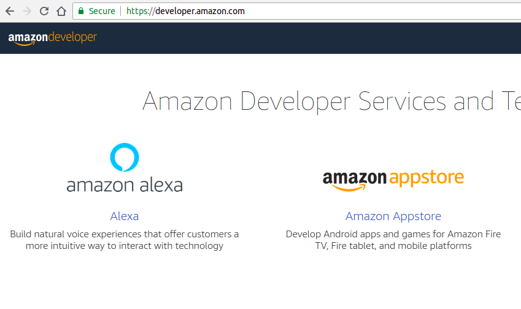
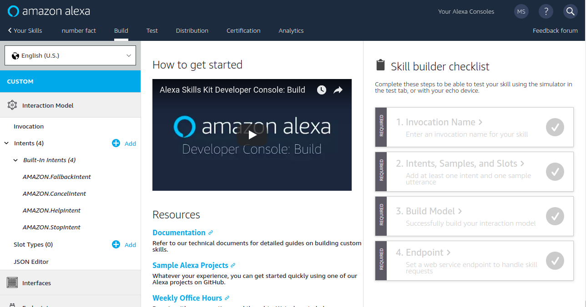
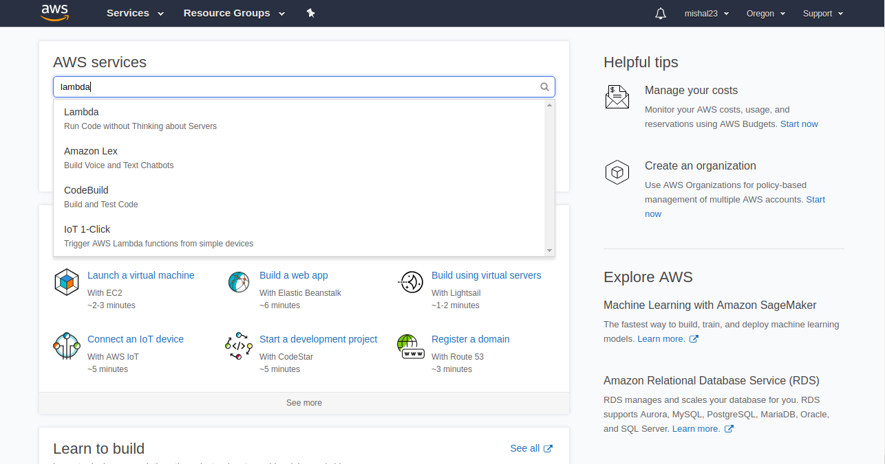
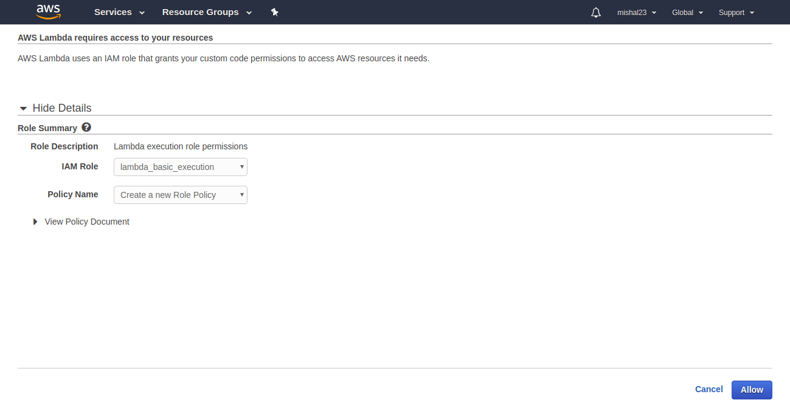
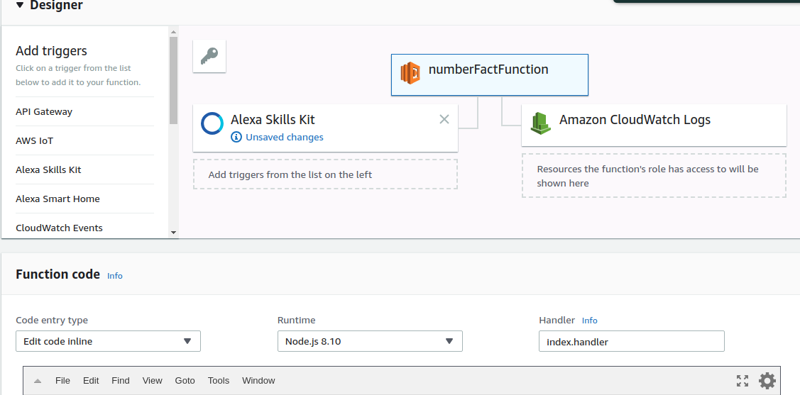
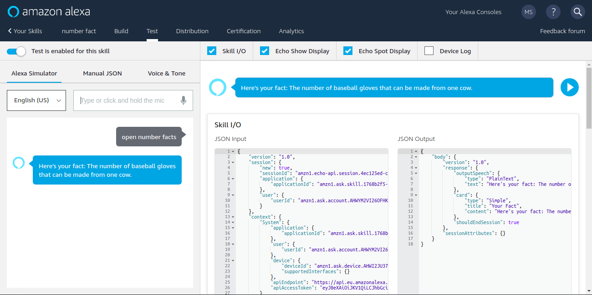

## Introduction
Learning to build voice user interface is a great skill to have as devices like the Amazon Echo and Google Home are gaining popularity. Amazon is currently running an incentive program this July(2018) for people developing Alexa Skills. You develop a new skill and get a limited-edition Alexa developer T-shirt! If more than 100 customers enable and use your skill in the first 30 days of publication, you could also receive an Echo Dot.


Sounds pretty cool right? Apart from the T-shirt or Echo Dot, you'll also learn developing something for voice assistant. If this seems like a good opportunity, read ahead!

## What is Alexa and how does it work?

Alexa is a cloud-based voice service that powers millions of voice experiences in the home. Devices Alexa powers includes Amazon Echo, Echo Dot, Amazon Tap and Amazon Fire TV.

What is a **skill**? They are basically apps(programs) that extend Echo's functionality and features. There are lot of amazing skills already being developed by Alexa developers from over the world. Check them out [here](https://www.amazon.com/alexa-skills/b?ie=UTF8&node=13727921011). They can answer questions, play trivia games, play music, set alarms, tell jokes and many more. Here is how it works:

* User speaks something
* The skill(defined on the Amazon Developer Site) matches the question(keywords) with an Intent(what the user is trying to ask) and then sends this Intent to an endpoint(an API call to the server like AWS Lambda)
* Lambda or your own server is where the data is stored. It has code to take the Intent and return the relevant response, taken from the data.
* Echo speaks back this response to the user.

## What do you need to start?

* An [Amazon Developer account](https://developer.amazon.com/), to create a skill.
* An [Amazon AWS account](https://developer.amazon.com/), to create a Lambda function.
* An idea! The skill you create is an app, and just like any other app in the market your app should have a good use case.

## Creating the skill

I'll explain how to create a fact skill in this blog post, you can dive into deeper to create some awesome skills. At the end, there is a list of amazing tutorials for you to learn more.

Go to [Amazon Developer Account](https://developer.amazon.com/) and sign in, and select Alexa.


On the Alexa Page, on the top-right, hover over the `Your Alexa Consoles` and click Skills.


Click on the `Create Skill` button.


Fill out the information,
* Skill Name: Number Fact
* Skill Model: Custom
* Skill Language: English(U.S.)

Click, Create Skill and you'll see a page similar to this.



Now click Invocation in the left hand navigation panel, and set the Invocation Name. Invocation Name is what your user will need to say to start the skill. As the skill is number facts, setting the Invocation Name to: Number Facts, Click on Save Model and move to JSON Editor for the Interaction Model.


This is now the core of the skill, Here we define,

* an Intent Schema
* Custom Slot Types
* Sample Utterances

### Intent Schema

These are the "intents" of the Skill, which define the "intent" or purpose of something the user says to the Skill. So we may have a `GetNewFactIntent` intent, which signifies that the user wants to know an fact. They are defined in this format:

```json
 {
      "intents": [
        {
          "name": "AMAZON.CancelIntent"
        },
        {
          "name": "AMAZON.HelpIntent"
        },
        {
          "name": "AMAZON.StopIntent"
        },
        {
          "name": "AMAZON.FallbackIntent"
        },
        {
          "name": "GetNewFactIntent"
        }
      ]
 }
```

The AMAZON.HelpIntent is a default Amazon intent that you can use to handle any **Help** type questions. Likewise, AMAZON.StopIntent is a inbuilt intent to handle "stop" intents.

### Custom Slot Types

Here we give examples of "utterances" - what the user may say for each intent. Each utterance goes on its own line and starts with the intent it is associated with e.g.

> a fact

For each intent, we list the maximum possible ways that users may say it:

> "a fact",<br>
> "a number fact",<br>
> "tell me a fact",<br>
> "tell me a number fact",<br>
> "give me a fact",<br>
> "give me a number fact",<br>
> "give me some number information"

We put all this in the JSON Editor and hit Save Model, and then Build Model. Your JSON should look similar to this. You'll see a message like:

 

then 


Now, it's time to set the endpoint, Click on `Endpoint` button in the left navigation bar. This where we specify where the Intent information goes when the user asks a question. The options are:
* AWS Lambda - a Lambda endpoint
* HTTPS - your own endpoint

We'll be using AWS Lambda here.

## AWS Lambda

If you haven’t used AWS Lambda before, it’s a service that allows you to host code with its own endpoint, without a server. More info here. Heard of Serverless apps?

Go to [Amazon Web Services](https://aws.amazon.com/) and sign in the portal, and go to Lambda service.



Once on Lambda home page, click on the orange button to create the Lambda function.


Choose `Author from Scratch`, and then name your function in camelCase, for me, **numberFactFunction**.
Choose, RunTime as Node.js 8.10, and in Role dropdown, choose, **Create a Custom Role**. This will open a new window, in that click on Allow. Read more about IAM Roles [here](https://docs.aws.amazon.com/IAM/latest/UserGuide/id_roles.html).



Then on the back on Lambda Page, select **lambda_basic_execution** in the Existing Role, and click `Create Function`.

Now, we need to add Trigger, for we are developing Alexa Skill Kit, click on Alexa Skill Kit in the left navigation.


In Configure trigger, copy the Skill ID from the Developer Console, and paste it here, and click on Add. Skill ID will be in the form **amzn1.ask.skill......** After this is done, click on the numberFactFunction where we added the trigger, this will show the Function Code at the bottom.



Add the `index.js` code from [here](https://gist.github.com/mishal23/4499d20a24e3e5ce6f5db11bd02277a9), also add the `AlexaSkill.js` from the same link in the function code by creating a new file.

File `AlexaSkill.js` has specific event handlers. It specifies the output, prompt and speech. The Index.js file lets you customize meet the needs of your Skill. Click on Save.

From the right-top of the page, copy the ARN value, it's of the form `arn:aws:lambda:region:function:nameOfFunction`. Go to Amazon Developer Console, Select your skill and click on Endpoint	in the left navigation bar. Select AWS Lambda ARN and paste the ARN code copied in the default region input box. Click on Save Endpoints. And you'll see a popup similar to the below image saying Skill Manifest Saved Successfully.

	

In the top navigation bar, click on Test tab. If the test is disabled, enable it and either speak or type the Open Invocation Name , for this skill, `Open Number Facts`, and watch Alexa speaking the fact. :D

	

Enter the distribution and Certification details as required, and submit the skill for certification. It takes a few days to hear back from the Amazon Developer Team. If your Skill is approved then everything works and all of the information is agreeing to their standards. Your Skill will be certified and published and available for others to use. If not, you will receive feedback and suggestions on what you need to to to resolve any issues so you can re-submit.

If your skill is unique across the alexa skills present, you'll also receive the limited edition T-Shirt.

Hope you learned on how to build skills, if you develop more you'll have more familiarity with JavaScript and Node.js. It’s very different creating something that is voice activated by an end user as compared to reading on a screen. Hoping to see more Alexa developers, feel free to contact in case there is any issue developing a skill.

<!-- You’ll find this post in your `_posts` directory. Go ahead and edit it and re-build the site to see your changes. You can rebuild the site in many different ways, but the most common way is to run `jekyll serve`, which launches a web server and auto-regenerates your site when a file is updated.

To add new posts, simply add a file in the `_posts` directory that follows the convention `YYYY-MM-DD-name-of-post.ext` and includes the necessary front matter. Take a look at the source for this post to get an idea about how it works.

Jekyll also offers powerful support for code snippets:


def print_hi(name)
  puts "Hi, #{name}"
end
print_hi('Tom')
#=> prints 'Hi, Tom' to STDOUT.


Check out the [Jekyll docs][jekyll-docs] for more info on how to get the most out of Jekyll. File all bugs/feature requests at [Jekyll’s GitHub repo][jekyll-gh]. If you have questions, you can ask them on [Jekyll Talk][jekyll-talk]. -->

[jekyll-docs]: https://jekyllrb.com/docs/home
[jekyll-gh]:   https://github.com/jekyll/jekyll
[jekyll-talk]: https://talk.jekyllrb.com/
